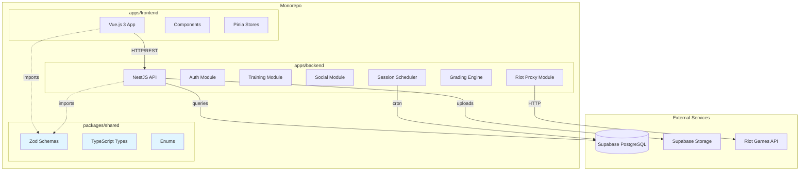
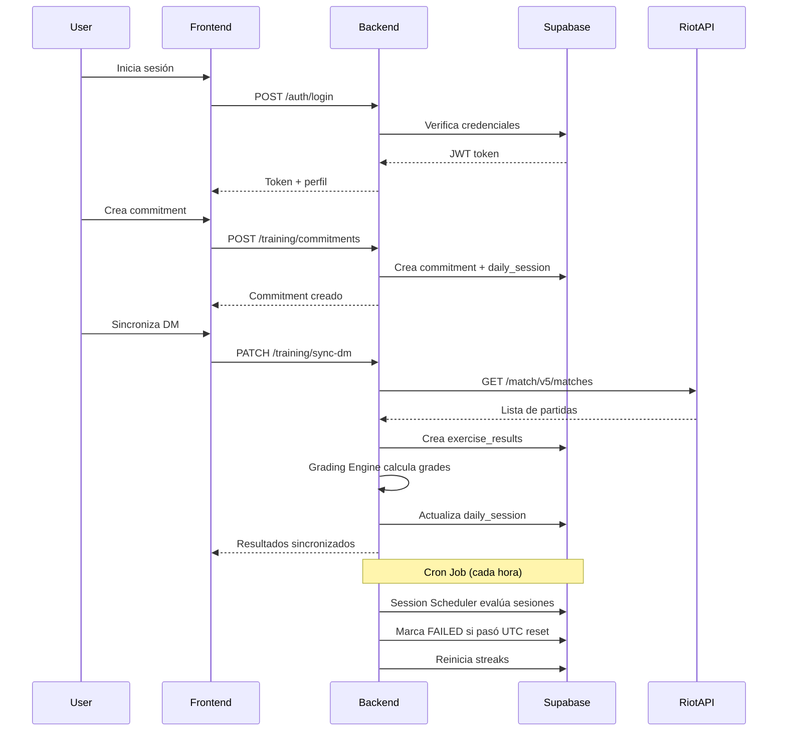
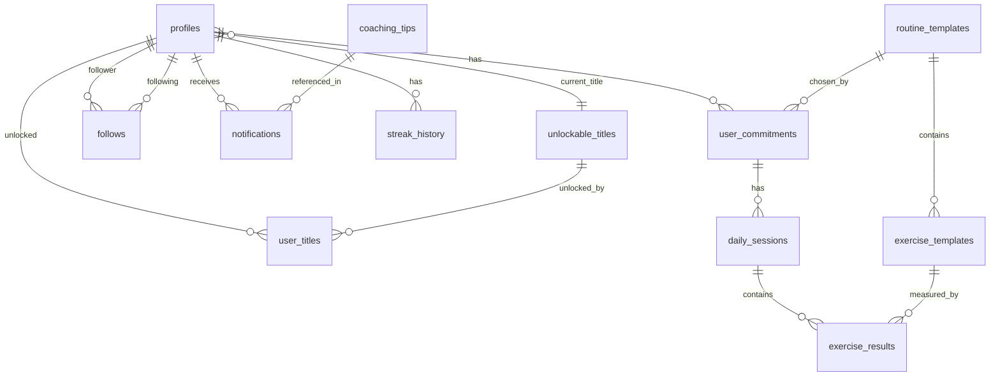

# Documento de Diseño Técnico

## Overview

VALORANT Performance Academy (VPA) es una plataforma de entrenamiento de alto rendimiento para jugadores de VALORANT, diseñada como un monorepo moderno que combina un backend robusto en NestJS, un frontend reactivo en Vue.js 3, y un paquete compartido de tipos y validaciones. La arquitectura está optimizada para sincronización automática con la API de Riot Games, gestión de ciclos de entrenamiento diarios alineados con el reinicio UTC de VALORANT, y un sistema social que fomenta la consistencia mediante rachas y feedback dinámico.

### Objetivos de Diseño

1. **Modularidad**: Separación clara entre backend, frontend y código compartido mediante monorepo
2. **Type Safety**: Validación end-to-end usando Zod schemas compartidos
3. **Sincronización Automática**: Integración transparente con la API de Riot Games para partidas Deathmatch
4. **Consistencia Temporal**: Alineación estricta con el ciclo UTC de VALORANT (00:00 UTC reset)
5. **Escalabilidad**: Arquitectura preparada para crecimiento de usuarios y datos
6. **Seguridad**: RLS policies en Supabase, rate limiting, y validación exhaustiva

### Stack Tecnológico

- **Monorepo**: Turborepo + pnpm workspaces
- **Backend**: NestJS (TypeScript), @nestjs/throttler para rate limiting
- **Frontend**: Vue.js 3 (Composition API), TypeScript, TailwindCSS, Shadcn/ui (única librería de componentes permitida)
- **Database**: Supabase PostgreSQL con Row Level Security (RLS)
- **Shared Package**: Zod para schemas de validación, tipos TypeScript compartidos
- **External API**: Riot Games API para sincronización de partidas
- **Storage**: Supabase Storage para avatares de usuario

## Architecture

### High-Level Architecture




### Arquitectura del Monorepo

El proyecto está organizado como un monorepo gestionado por Turborepo y pnpm workspaces:

```
vpa-monorepo/
├── apps/
│   ├── backend/          # NestJS API
│   └── frontend/         # Vue.js 3 App
├── packages/
│   └── shared/           # @vpa/shared - Tipos y schemas compartidos
├── supabase/
│   ├── migrations/       # Migraciones de base de datos
│   └── seed.sql          # Datos iniciales
├── turbo.json            # Configuración de Turborepo
├── pnpm-workspace.yaml   # Configuración de workspaces
└── package.json
```

**Beneficios de esta arquitectura:**
- Builds coordinados y cacheados mediante Turborepo
- Dependencias compartidas optimizadas con pnpm
- Type safety garantizado entre frontend y backend
- Versionado unificado del código compartido

### Flujo de Datos Principal




## Components and Interfaces

### Backend Modules (NestJS)

#### 1. Auth Module

**Responsabilidades:**
- Autenticación de usuarios mediante Supabase Auth
- Verificación de cuentas Riot Games
- Desvinculación de cuentas Riot
- Gestión de perfiles de usuario

**Servicios principales:**
- `AuthService`: Lógica de autenticación y verificación
- `ProfileService`: CRUD de perfiles de usuario

**Endpoints:**
- `POST /auth/login` - Autenticación de usuario
- `POST /auth/register` - Registro de nuevo usuario
- `POST /auth/verify-riot` - Verificación de cuenta Riot
- `DELETE /auth/unlink-riot` - Desvinculación de cuenta Riot
- `GET /profile` - Obtener perfil del usuario autenticado
- `PATCH /profile` - Actualizar perfil
- `POST /profile/avatar` - Subir avatar

#### 2. Training Module

**Responsabilidades:**
- Gestión de commitments (compromisos de entrenamiento)
- Gestión de daily sessions (sesiones diarias)
- Registro de exercise results (resultados de ejercicios)
- Carga manual de resultados de Galería
- Sincronización de partidas Deathmatch
- Analytics y métricas de progreso

**Servicios principales:**
- `CommitmentService`: CRUD de compromisos
- `SessionService`: Gestión de sesiones diarias
- `ResultService`: Gestión de resultados de ejercicios
- `AnalyticsService`: Cálculo de métricas y tendencias
- `GradingEngine`: Motor de calificación de resultados

**Endpoints:**
- `GET /training/routines` - Listar rutinas disponibles
- `POST /training/commitments` - Crear nuevo commitment
- `GET /training/commitments` - Listar commitments del usuario
- `PATCH /training/commitments/:id/drop` - Abandonar commitment
- `GET /training/today` - Obtener sesión de hoy
- `POST /training/submit-gallery` - Enviar resultados de Galería
- `PATCH /training/sync-dm` - Sincronizar partidas DM
- `GET /training/analytics` - Obtener métricas y análisis
- `GET /training/sessions` - Historial de sesiones


#### 3. Social Module

**Responsabilidades:**
- Gestión de relaciones de seguimiento (follows)
- Gestión de notificaciones
- Búsqueda y descubrimiento de usuarios
- Gestión de solicitudes de seguimiento pendientes

**Servicios principales:**
- `FollowService`: Lógica de follows y solicitudes
- `NotificationService`: Creación y gestión de notificaciones
- `SearchService`: Búsqueda de usuarios

**Endpoints:**
- `POST /social/follow/:userId` - Seguir a un usuario
- `DELETE /social/follow/:userId` - Dejar de seguir
- `GET /social/followers` - Listar seguidores
- `GET /social/following` - Listar seguidos
- `GET /social/follow-requests` - Listar solicitudes pendientes
- `PATCH /social/follow-requests/:id/accept` - Aceptar solicitud
- `DELETE /social/follow-requests/:id` - Rechazar solicitud
- `GET /social/notifications` - Listar notificaciones
- `PATCH /social/notifications/:id/read` - Marcar como leída
- `GET /social/search` - Buscar usuarios

#### 4. Riot Proxy Module

**Responsabilidades:**
- Comunicación con la API de Riot Games
- Rate limiting de solicitudes a Riot API
- Transformación de datos de Riot al formato VPA
- Manejo de errores de la API externa

**Servicios principales:**
- `RiotApiService`: Cliente HTTP para Riot API
- `RiotMatchService`: Obtención y parseo de partidas
- `RiotAccountService`: Verificación de cuentas

**Configuración:**
- Rate limit: 30 requests/minuto usando `@nestjs/throttler`
- Endpoints regionales según `profiles.region`
- Retry logic para errores transitorios

#### 5. Grading Engine (Servicio Centralizado)

**Responsabilidades:**
- Calcular grade (`BAD`, `PASSABLE`, `EXCELLENT`) basado en score y thresholds
- Aplicar lógica de calificación consistente en toda la plataforma

**Interfaz:**
```typescript
interface GradingEngine {
  calculateGrade(
    score: number,
    thresholdPass: number,
    thresholdExcellent: number
  ): Grade;
}
```

**Lógica:**
- `score >= thresholdExcellent` → `EXCELLENT`
- `score >= thresholdPass && score < thresholdExcellent` → `PASSABLE`
- `score < thresholdPass` → `BAD`


#### 6. Session Scheduler (Cron Job)

**Responsabilidades:**
- Ejecutarse cada hora para evaluar sesiones
- Marcar sesiones como `FAILED` si pasaron el UTC reset sin completarse
- Reiniciar streaks cuando se rompen
- Crear notificaciones de alerta de racha
- Crear daily sessions para el nuevo día

**Configuración:**
- Frecuencia: Cada hora (cron: `0 * * * *`)
- Timezone: UTC
- Idempotencia: Verificar antes de modificar

**Lógica:**
```typescript
// Pseudocódigo
async function runSessionScheduler() {
  const now = new Date(); // UTC
  const today = startOfDay(now);
  
  // 1. Marcar sesiones fallidas
  const failedSessions = await findSessionsInProgressBeforeToday(today);
  for (const session of failedSessions) {
    await markSessionAsFailed(session);
    await resetUserStreak(session.userId);
    await createStreakAlertNotification(session.userId);
  }
  
  // 2. Crear sesiones para hoy
  const activeCommitments = await findActiveCommitments();
  for (const commitment of activeCommitments) {
    await createDailySessionIfNotExists(commitment, today);
  }
}
```

### Frontend Components (Vue.js 3)

#### Stack de UI

El frontend usa exclusivamente **TailwindCSS** para estilos y **Shadcn/ui** como librería de componentes. No se permite ninguna otra librería de UI o CSS.

- **TailwindCSS**: Utilidades CSS para todos los estilos personalizados
- **Shadcn/ui**: Componentes base (Button, Card, Dialog, Input, Select, Badge, Table, Tabs, Sheet, etc.)
- **Regla**: Cualquier componente visual debe construirse sobre primitivos de Shadcn/ui estilizados con clases de Tailwind

#### Estructura de Componentes

```
src/
├── components/
│   ├── ui/              # Componentes Shadcn/ui instalados (auto-generados)
│   │   ├── button.vue
│   │   ├── card.vue
│   │   ├── dialog.vue
│   │   ├── input.vue
│   │   ├── badge.vue
│   │   ├── tabs.vue
│   │   └── ...
│   ├── auth/
│   │   ├── LoginForm.vue          # Usa: Card, Input, Button de Shadcn
│   │   ├── RegisterForm.vue       # Usa: Card, Input, Button de Shadcn
│   │   └── RiotVerification.vue   # Usa: Dialog, Input, Button de Shadcn
│   ├── training/
│   │   ├── RoutineCatalog.vue     # Usa: Card, Badge, Button de Shadcn
│   │   ├── CommitmentCard.vue     # Usa: Card, Badge, Progress de Shadcn
│   │   ├── DailySessionView.vue   # Usa: Tabs, Card, Badge de Shadcn
│   │   ├── GallerySubmitForm.vue  # Usa: Dialog, Input, Button de Shadcn
│   │   ├── DMSyncButton.vue       # Usa: Button, Badge de Shadcn
│   │   └── AnalyticsDashboard.vue # Usa: Card, Tabs, Select de Shadcn
│   ├── social/
│   │   ├── UserSearch.vue         # Usa: Input, Card, Button de Shadcn
│   │   ├── FollowButton.vue       # Usa: Button de Shadcn
│   │   ├── FollowersList.vue      # Usa: Card, Avatar de Shadcn
│   │   ├── NotificationFeed.vue   # Usa: Sheet, Badge, Card de Shadcn
│   │   └── FollowRequestCard.vue  # Usa: Card, Button de Shadcn
│   └── profile/
│       ├── ProfileView.vue        # Usa: Card, Badge, Tabs de Shadcn
│       ├── ProfileEdit.vue        # Usa: Dialog, Input, Select de Shadcn
│       ├── AvatarUpload.vue       # Usa: Dialog, Button de Shadcn
│       └── StreakDisplay.vue      # Usa: Card, Badge de Shadcn
├── stores/
│  


### Shared Package (@vpa/shared)

**Estructura:**
```
packages/shared/
├── src/
│   ├── schemas/
│   │   ├── auth.schemas.ts
│   │   ├── training.schemas.ts
│   │   ├── social.schemas.ts
│   │   └── profile.schemas.ts
│   ├── types/
│   │   ├── database.types.ts    # Generado por Supabase
│   │   ├── api.types.ts
│   │   └── index.ts
│   ├── enums/
│   │   ├── grade.enum.ts
│   │   ├── region.enum.ts
│   │   ├── exercise-type.enum.ts
│   │   └── index.ts
│   └── index.ts
├── package.json
└── tsconfig.json
```

**Schemas Zod Principales:**

```typescript
// training.schemas.ts
export const CreateCommitmentSchema = z.object({
  routineId: z.string().uuid(),
  durationDays: z.union([z.literal(7), z.literal(14), z.literal(30), z.null()]),
});

export const SubmitGallerySchema = z.object({
  sessionId: z.string().uuid(),
  results: z.array(z.object({
    exerciseId: z.string().uuid(),
    score: z.number().nonnegative(),
  })),
});

export const AnalyticsQuerySchema = z.object({
  exerciseId: z.string().uuid().optional(),
  date: z.string().datetime().optional(),
  week: z.number().int().positive().optional(),
  startDate: z.string().datetime().optional(),
  endDate: z.string().datetime().optional(),
});

// profile.schemas.ts
export const UpdateProfileSchema = z.object({
  username: z.string().min(3).max(20).optional(),
  bio: z.string().max(500).optional(),
  timezone: z.string().optional(), // Validar IANA timezone
  privacyMode: z.boolean().optional(),
  title: z.string().uuid().optional(),
});

// auth.schemas.ts
export const VerifyRiotSchema = z.object({
  riotId: z.string().min(1),
  riotTag: z.string().min(1),
  region: z.enum(['na', 'latam', 'eu', 'ap', 'kr']),
});
```

**Enums:**

```typescript
// grade.enum.ts
export enum Grade {
  BAD = 'BAD',
  PASSABLE = 'PASSABLE',
  EXCELLENT = 'EXCELLENT',
}

// region.enum.ts
export enum Region {
  NA = 'na',
  LATAM = 'latam',
  EU = 'eu',
  AP = 'ap',
  KR = 'kr',
}

// exercise-type.enum.ts
export enum ExerciseType {
  GALLERY = 'GALLERY',
  DM = 'DM',
}
```


## Data Models

### Esquema de Base de Datos

La base de datos PostgreSQL en Supabase contiene las siguientes tablas principales:

#### 1. profiles

Almacena información de perfil de usuario.

```sql
CREATE TABLE profiles (
  id UUID PRIMARY KEY REFERENCES auth.users(id) ON DELETE CASCADE,
  username TEXT UNIQUE NOT NULL,
  riot_id TEXT,
  riot_tag TEXT,
  region TEXT CHECK (region IN ('na', 'latam', 'eu', 'ap', 'kr')),
  avatar_url TEXT,
  bio TEXT,
  title UUID REFERENCES unlockable_titles(id),
  current_streak INTEGER DEFAULT 0 NOT NULL,
  max_streak INTEGER DEFAULT 0 NOT NULL,
  privacy_mode BOOLEAN DEFAULT false NOT NULL,
  timezone TEXT DEFAULT 'UTC' NOT NULL,
  last_sync_at TIMESTAMPTZ,
  created_at TIMESTAMPTZ DEFAULT NOW() NOT NULL,
  updated_at TIMESTAMPTZ DEFAULT NOW() NOT NULL
);

CREATE INDEX idx_profiles_username ON profiles(username);
CREATE INDEX idx_profiles_riot ON profiles(riot_id, riot_tag);
```

**RLS Policies:**
```sql
-- Lectura: público si privacy_mode=false, privado solo para owner y followers
CREATE POLICY "Public profiles are viewable by everyone"
  ON profiles FOR SELECT
  USING (
    privacy_mode = false 
    OR auth.uid() = id
    OR EXISTS (
      SELECT 1 FROM follows 
      WHERE follower_id = auth.uid() 
      AND following_id = profiles.id 
      AND status = 'accepted'
    )
  );

-- Actualización: solo el propietario
CREATE POLICY "Users can update own profile"
  ON profiles FOR UPDATE
  USING (auth.uid() = id);
```


#### 2. routine_templates

Plantillas de rutinas de entrenamiento creadas por administradores.

```sql
CREATE TABLE routine_templates (
  id UUID PRIMARY KEY DEFAULT gen_random_uuid(),
  pro_name TEXT NOT NULL,
  title TEXT NOT NULL,
  description TEXT,
  is_active BOOLEAN DEFAULT true NOT NULL,
  created_at TIMESTAMPTZ DEFAULT NOW() NOT NULL
);

CREATE INDEX idx_routine_templates_active ON routine_templates(is_active);
```

**RLS Policies:**
```sql
-- Lectura: todos los usuarios autenticados pueden ver rutinas activas
CREATE POLICY "Active routines are viewable by authenticated users"
  ON routine_templates FOR SELECT
  USING (is_active = true AND auth.uid() IS NOT NULL);

-- Escritura: solo administradores (implementar con custom claim)
```

#### 3. exercise_templates

Plantillas de ejercicios individuales dentro de rutinas.

```sql
CREATE TABLE exercise_templates (
  id UUID PRIMARY KEY DEFAULT gen_random_uuid(),
  routine_id UUID NOT NULL REFERENCES routine_templates(id) ON DELETE CASCADE,
  name TEXT NOT NULL,
  metric_unit TEXT NOT NULL, -- 'kills', 'accuracy', 'score', etc.
  type TEXT NOT NULL CHECK (type IN ('GALLERY', 'DM')),
  threshold_pass NUMERIC NOT NULL,
  threshold_excellent NUMERIC NOT NULL,
  is_indefinite BOOLEAN DEFAULT false NOT NULL,
  created_at TIMESTAMPTZ DEFAULT NOW() NOT NULL,
  
  CONSTRAINT valid_thresholds CHECK (threshold_excellent >= threshold_pass)
);

CREATE INDEX idx_exercise_templates_routine ON exercise_templates(routine_id);
CREATE INDEX idx_exercise_templates_type ON exercise_templates(type);
```

**RLS Policies:**
```sql
-- Lectura: todos los usuarios autenticados
CREATE POLICY "Exercise templates are viewable by authenticated users"
  ON exercise_templates FOR SELECT
  USING (auth.uid() IS NOT NULL);
```


#### 4. user_commitments

Compromisos activos de usuarios con rutinas.

```sql
CREATE TABLE user_commitments (
  id UUID PRIMARY KEY DEFAULT gen_random_uuid(),
  user_id UUID NOT NULL REFERENCES profiles(id) ON DELETE CASCADE,
  routine_id UUID NOT NULL REFERENCES routine_templates(id) ON DELETE CASCADE,
  duration_days INTEGER CHECK (duration_days IN (7, 14, 30) OR duration_days IS NULL),
  start_date TIMESTAMPTZ DEFAULT NOW() NOT NULL,
  status TEXT DEFAULT 'active' NOT NULL CHECK (status IN ('active', 'completed', 'dropped')),
  created_at TIMESTAMPTZ DEFAULT NOW() NOT NULL,
  
  CONSTRAINT one_active_commitment_per_user UNIQUE (user_id, status) 
    WHERE (status = 'active')
);

CREATE INDEX idx_user_commitments_user ON user_commitments(user_id);
CREATE INDEX idx_user_commitments_status ON user_commitments(status);
```

**RLS Policies:**
```sql
-- Lectura: solo el propietario
CREATE POLICY "Users can view own commitments"
  ON user_commitments FOR SELECT
  USING (auth.uid() = user_id);

-- Inserción: solo el propietario
CREATE POLICY "Users can create own commitments"
  ON user_commitments FOR INSERT
  WITH CHECK (auth.uid() = user_id);

-- Actualización: solo el propietario
CREATE POLICY "Users can update own commitments"
  ON user_commitments FOR UPDATE
  USING (auth.uid() = user_id);
```

#### 5. daily_sessions

Sesiones de entrenamiento diarias para cada commitment.

```sql
CREATE TABLE daily_sessions (
  id UUID PRIMARY KEY DEFAULT gen_random_uuid(),
  commitment_id UUID NOT NULL REFERENCES user_commitments(id) ON DELETE CASCADE,
  date DATE NOT NULL,
  status TEXT DEFAULT 'IN_PROGRESS' NOT NULL CHECK (status IN ('IN_PROGRESS', 'COMPLETED', 'FAILED')),
  is_gallery_done BOOLEAN DEFAULT false NOT NULL,
  is_dm_done BOOLEAN DEFAULT false NOT NULL,
  created_at TIMESTAMPTZ DEFAULT NOW() NOT NULL,
  updated_at TIMESTAMPTZ DEFAULT NOW() NOT NULL,
  
  CONSTRAINT unique_session_per_day UNIQUE (commitment_id, date)
);

CREATE INDEX idx_daily_sessions_commitment ON daily_sessions(commitment_id);
CREATE INDEX idx_daily_sessions_date ON daily_sessions(date);
CREATE INDEX idx_daily_sessions_status ON daily_sessions(status);
```

**RLS Policies:**
```sql
-- Lectura: solo el propietario del commitment
CREATE POLICY "Users can view own sessions"
  ON daily_sessions FOR SELECT
  USING (
    EXISTS (
      SELECT 1 FROM user_commitments 
      WHERE id = daily_sessions.commitment_id 
      AND user_id = auth.uid()
    )
  );

-- Actualización: solo el propietario del commitment
CREATE POLICY "Users can update own sessions"
  ON daily_sessions FOR UPDATE
  USING (
    EXISTS (
      SELECT 1 FROM user_commitments 
      WHERE id = daily_sessions.commitment_id 
      AND user_id = auth.uid()
    )
  );
```


#### 6. exercise_results

Resultados individuales de ejercicios dentro de sesiones.

```sql
CREATE TABLE exercise_results (
  id UUID PRIMARY KEY DEFAULT gen_random_uuid(),
  session_id UUID NOT NULL REFERENCES daily_sessions(id) ON DELETE CASCADE,
  exercise_id UUID NOT NULL REFERENCES exercise_templates(id) ON DELETE CASCADE,
  score NUMERIC NOT NULL CHECK (score >= 0),
  grade TEXT NOT NULL CHECK (grade IN ('BAD', 'PASSABLE', 'EXCELLENT')),
  riot_match_id TEXT, -- Solo para ejercicios DM
  created_at TIMESTAMPTZ DEFAULT NOW() NOT NULL,
  
  CONSTRAINT unique_riot_match UNIQUE (riot_match_id) WHERE (riot_match_id IS NOT NULL)
);

CREATE INDEX idx_exercise_results_session ON exercise_results(session_id);
CREATE INDEX idx_exercise_results_exercise ON exercise_results(exercise_id);
CREATE INDEX idx_exercise_results_riot_match ON exercise_results(riot_match_id);
CREATE INDEX idx_exercise_results_grade ON exercise_results(grade);
```

**RLS Policies:**
```sql
-- Lectura, inserción y actualización: solo el propietario del commitment
CREATE POLICY "Users can manage own exercise results"
  ON exercise_results FOR ALL
  USING (
    EXISTS (
      SELECT 1 FROM daily_sessions ds
      JOIN user_commitments uc ON ds.commitment_id = uc.id
      WHERE ds.id = exercise_results.session_id 
      AND uc.user_id = auth.uid()
    )
  );
```

#### 7. follows

Relaciones de seguimiento entre usuarios.

```sql
CREATE TABLE follows (
  id UUID PRIMARY KEY DEFAULT gen_random_uuid(),
  follower_id UUID NOT NULL REFERENCES profiles(id) ON DELETE CASCADE,
  following_id UUID NOT NULL REFERENCES profiles(id) ON DELETE CASCADE,
  status TEXT DEFAULT 'pending' NOT NULL CHECK (status IN ('pending', 'accepted')),
  created_at TIMESTAMPTZ DEFAULT NOW() NOT NULL,
  
  CONSTRAINT no_self_follow CHECK (follower_id != following_id),
  CONSTRAINT unique_follow UNIQUE (follower_id, following_id)
);

CREATE INDEX idx_follows_follower ON follows(follower_id);
CREATE INDEX idx_follows_following ON follows(following_id);
CREATE INDEX idx_follows_status ON follows(status);
```

**RLS Policies:**
```sql
-- Lectura: follower y following pueden ver sus propias relaciones
CREATE POLICY "Users can view own follows"
  ON follows FOR SELECT
  USING (auth.uid() = follower_id OR auth.uid() = following_id);

-- Inserción: solo el follower
CREATE POLICY "Users can create follows"
  ON follows FOR INSERT
  WITH CHECK (auth.uid() = follower_id);

-- Actualización: solo el following (para aceptar)
CREATE POLICY "Users can accept follow requests"
  ON follows FOR UPDATE
  USING (auth.uid() = following_id);

-- Eliminación: follower o following
CREATE POLICY "Users can delete follows"
  ON follows FOR DELETE
  USING (auth.uid() = follower_id OR auth.uid() = following_id);
```


#### 8. notifications

Notificaciones para usuarios (follow requests, streak alerts, coaching tips).

```sql
CREATE TABLE notifications (
  id UUID PRIMARY KEY DEFAULT gen_random_uuid(),
  user_id UUID NOT NULL REFERENCES profiles(id) ON DELETE CASCADE,
  type TEXT NOT NULL CHECK (type IN ('FOLLOW_REQ', 'STREAK_ALERT', 'COACH_TIP')),
  data JSONB NOT NULL, -- Datos específicos del tipo de notificación
  is_read BOOLEAN DEFAULT false NOT NULL,
  created_at TIMESTAMPTZ DEFAULT NOW() NOT NULL
);

CREATE INDEX idx_notifications_user ON notifications(user_id);
CREATE INDEX idx_notifications_type ON notifications(type);
CREATE INDEX idx_notifications_is_read ON notifications(is_read);
CREATE INDEX idx_notifications_created_at ON notifications(created_at DESC);
```

**RLS Policies:**
```sql
-- Lectura: solo el propietario
CREATE POLICY "Users can view own notifications"
  ON notifications FOR SELECT
  USING (auth.uid() = user_id);

-- Actualización: solo el propietario (para marcar como leída)
CREATE POLICY "Users can update own notifications"
  ON notifications FOR UPDATE
  USING (auth.uid() = user_id);
```

#### 9. coaching_tips

Consejos de coaching predefinidos por categoría y trigger.

```sql
CREATE TABLE coaching_tips (
  id UUID PRIMARY KEY DEFAULT gen_random_uuid(),
  category TEXT NOT NULL, -- 'aim', 'movement', 'positioning', etc.
  grade_trigger TEXT NOT NULL CHECK (grade_trigger IN ('BAD', 'PASSABLE')),
  message TEXT NOT NULL,
  created_at TIMESTAMPTZ DEFAULT NOW() NOT NULL
);

CREATE INDEX idx_coaching_tips_category ON coaching_tips(category);
CREATE INDEX idx_coaching_tips_grade ON coaching_tips(grade_trigger);
```

**RLS Policies:**
```sql
-- Lectura: todos los usuarios autenticados
CREATE POLICY "Coaching tips are viewable by authenticated users"
  ON coaching_tips FOR SELECT
  USING (auth.uid() IS NOT NULL);
```


#### 10. unlockable_titles

Títulos desbloqueables basados en logros.

```sql
CREATE TABLE unlockable_titles (
  id UUID PRIMARY KEY DEFAULT gen_random_uuid(),
  name TEXT NOT NULL,
  description TEXT,
  unlock_condition_type TEXT NOT NULL CHECK (
    unlock_condition_type IN ('STREAK_REACHED', 'ROUTINES_COMPLETED', 'SESSIONS_COMPLETED')
  ),
  unlock_condition_value INTEGER NOT NULL,
  created_at TIMESTAMPTZ DEFAULT NOW() NOT NULL
);

CREATE INDEX idx_unlockable_titles_condition ON unlockable_titles(unlock_condition_type);
```

**RLS Policies:**
```sql
-- Lectura: todos los usuarios autenticados
CREATE POLICY "Titles are viewable by authenticated users"
  ON unlockable_titles FOR SELECT
  USING (auth.uid() IS NOT NULL);
```

#### 11. user_titles

Títulos desbloqueados por usuarios.

```sql
CREATE TABLE user_titles (
  user_id UUID NOT NULL REFERENCES profiles(id) ON DELETE CASCADE,
  title_id UUID NOT NULL REFERENCES unlockable_titles(id) ON DELETE CASCADE,
  unlocked_at TIMESTAMPTZ DEFAULT NOW() NOT NULL,
  
  PRIMARY KEY (user_id, title_id)
);

CREATE INDEX idx_user_titles_user ON user_titles(user_id);
```

**RLS Policies:**
```sql
-- Lectura: solo el propietario
CREATE POLICY "Users can view own titles"
  ON user_titles FOR SELECT
  USING (auth.uid() = user_id);
```

#### 12. streak_history

Historial de rachas de usuarios.

```sql
CREATE TABLE streak_history (
  id UUID PRIMARY KEY DEFAULT gen_random_uuid(),
  user_id UUID NOT NULL REFERENCES profiles(id) ON DELETE CASCADE,
  streak_value INTEGER NOT NULL,
  started_at TIMESTAMPTZ NOT NULL,
  ended_at TIMESTAMPTZ,
  status TEXT DEFAULT 'active' NOT NULL CHECK (status IN ('active', 'broken')),
  created_at TIMESTAMPTZ DEFAULT NOW() NOT NULL
);

CREATE INDEX idx_streak_history_user ON streak_history(user_id);
CREATE INDEX idx_streak_history_started_at ON streak_history(started_at DESC);
```

**RLS Policies:**
```sql
-- Lectura: solo el propietario
CREATE POLICY "Users can view own streak history"
  ON streak_history FOR SELECT
  USING (auth.uid() = user_id);
```


### Diagrama de Relaciones (ERD)



### Validaciones de Datos a Nivel de Aplicación

Además de las constraints de base de datos, el backend implementa validaciones adicionales usando Zod:

1. **Scores**: Rangos específicos por `metric_unit`
   - `kills`: 0-40
   - `accuracy`: 0-100
   - `score`: 0-10000

2. **Timezone**: Validación contra lista IANA de timezones válidos

3. **Username**: Regex para caracteres permitidos, longitud 3-20

4. **Avatar**: Validación de tipo MIME y tamaño máximo 2MB

5. **Riot ID/Tag**: Formato específico de Riot Games


## Correctness Properties

*Una propiedad es una característica o comportamiento que debe mantenerse verdadero en todas las ejecuciones válidas de un sistema - esencialmente, una declaración formal sobre lo que el sistema debe hacer. Las propiedades sirven como puente entre las especificaciones legibles por humanos y las garantías de corrección verificables por máquinas.*

### Property 1: Creación de Perfil en Registro

*Para cualquier* usuario que se registre en la plataforma, debe existir un registro correspondiente en la tabla `profiles` con `id` igual al `auth.uid()` del usuario.

**Validates: Requirements 3.1**

### Property 2: Unicidad de Username

*Para cualquier* par de perfiles en el sistema, sus valores de `username` deben ser diferentes.

**Validates: Requirements 3.2**

### Property 3: Inicialización de Racha

*Para cualquier* perfil recién creado, el campo `current_streak` debe inicializarse con el valor `0`.

**Validates: Requirements 3.4**

### Property 4: Autorización de Actualización de Perfil

*Para cualquier* intento de actualización de perfil, la operación debe ser permitida solo si el `auth.uid()` del usuario autenticado coincide con el `id` del perfil que se intenta actualizar.

**Validates: Requirements 3.5**

### Property 5: Follow Automático en Perfiles Públicos

*Para cualquier* solicitud de seguimiento enviada a un perfil con `privacy_mode = false`, el registro de `follows` creado debe tener `status = 'accepted'` inmediatamente.

**Validates: Requirements 4.2**

### Property 6: Follow Pendiente en Perfiles Privados

*Para cualquier* solicitud de seguimiento enviada a un perfil con `privacy_mode = true`, el registro de `follows` creado debe tener `status = 'pending'`.

**Validates: Requirements 4.3**


### Property 7: Inicialización de Commitment

*Para cualquier* commitment recién creado, debe tener `status = 'active'` y `start_date` debe estar dentro de un margen de 5 segundos del timestamp UTC actual.

**Validates: Requirements 6.4**

### Property 8: Completado Automático de Commitment

*Para cualquier* commitment con `duration_days` definido (no NULL), cuando el número de daily sessions con `status = 'COMPLETED'` sea igual a `duration_days`, el `status` del commitment debe establecerse a `'completed'`.

**Validates: Requirements 6.5**

### Property 9: Completado de Sesión Diaria

*Para cualquier* daily session donde `is_gallery_done = true` AND `is_dm_done = true`, el campo `status` debe ser `'COMPLETED'`.

**Validates: Requirements 7.5**

### Property 10: Incremento de Racha al Completar Sesión

*Para cualquier* daily session que cambie su `status` a `'COMPLETED'`, el valor de `profiles.current_streak` del usuario correspondiente debe incrementarse en exactamente `1`.

**Validates: Requirements 7.6**

### Property 11: Grading EXCELLENT

*Para cualquier* exercise result donde `score >= exercise_templates.threshold_excellent`, el campo `grade` debe ser `'EXCELLENT'`.

**Validates: Requirements 8.3**

### Property 12: Grading PASSABLE

*Para cualquier* exercise result donde `score >= exercise_templates.threshold_pass` AND `score < exercise_templates.threshold_excellent`, el campo `grade` debe ser `'PASSABLE'`.

**Validates: Requirements 8.4**

### Property 13: Grading BAD

*Para cualquier* exercise result donde `score < exercise_templates.threshold_pass`, el campo `grade` debe ser `'BAD'`.

**Validates: Requirements 8.5**

### Property 14: Validación Zod en Galería

*Para cualquier* payload enviado a `POST /training/submit-gallery`, el payload debe ser validado contra el schema Zod correspondiente antes de procesarse.

**Validates: Requirements 9.1**


### Property 15: Rechazo de Payload Inválido con HTTP 422

*Para cualquier* payload que falle la validación del schema Zod, la respuesta HTTP debe tener código de estado `422` con detalles de los errores de validación.

**Validates: Requirements 9.4, 15.5**

### Property 16: Prevención de Duplicados de Riot Match

*Para cualquier* partida obtenida de la API de Riot con un `riot_match_id` que ya exista en la tabla `exercise_results`, no debe crearse un nuevo registro de exercise result.

**Validates: Requirements 10.3**

### Property 17: Marcado de Sesiones Fallidas por UTC Reset

*Para cualquier* daily session con `status = 'IN_PROGRESS'` cuyo campo `date` sea anterior a la fecha UTC actual, el Session Scheduler debe establecer su `status` a `'FAILED'`.

**Validates: Requirements 12.2**

### Property 18: Reinicio de Racha al Fallar Sesión

*Para cualquier* daily session que cambie su `status` a `'FAILED'`, el valor de `profiles.current_streak` del usuario correspondiente debe reiniciarse a `0`.

**Validates: Requirements 12.3**

### Property 19: Round-Trip de Serialización Zod

*Para cualquier* objeto de datos válido, serializar el objeto usando un schema Zod y luego deserializarlo debe producir un objeto equivalente al original.

**Validates: Requirements 15.4**

### Property 20: Sesiones Fallidas al Abandonar Commitment

*Para cualquier* commitment que cambie su `status` a `'dropped'`, todas las daily sessions asociadas con `status = 'IN_PROGRESS'` deben cambiar su `status` a `'FAILED'`.

**Validates: Requirements 19.2**

### Property 21: Preservación de Racha al Abandonar

*Para cualquier* commitment que cambie su `status` a `'dropped'`, el valor de `profiles.current_streak` del usuario NO debe modificarse.

**Validates: Requirements 19.3**


### Property 22: Metadata en Respuestas Paginadas

*Para cualquier* respuesta de API que implemente paginación, el objeto de respuesta debe contener los campos de metadata: `total`, `page`, `limit` y `totalPages`.

**Validates: Requirements 21.5**

### Property 23: Validación de Score No Negativo

*Para cualquier* exercise result enviado, el campo `score` debe ser un número mayor o igual a `0`.

**Validates: Requirements 27.1**

### Property 24: Rechazo de Score Inválido con HTTP 422

*Para cualquier* score que esté fuera del rango válido para su `metric_unit`, la respuesta HTTP debe tener código de estado `422` con un mensaje de error descriptivo.

**Validates: Requirements 27.4**

### Property 25: Invariante de Max Streak

*Para cualquier* usuario en cualquier momento, el valor de `profiles.max_streak` debe ser mayor o igual al valor de `profiles.current_streak`.

**Validates: Requirements 28.2**

## Error Handling

### Estrategia General de Manejo de Errores

El backend implementa una estrategia de manejo de errores consistente en toda la API:

#### Códigos de Estado HTTP

- **200 OK**: Operación exitosa
- **201 Created**: Recurso creado exitosamente
- **400 Bad Request**: Solicitud malformada (sintaxis incorrecta)
- **401 Unauthorized**: Usuario no autenticado
- **403 Forbidden**: Usuario autenticado pero sin permisos
- **404 Not Found**: Recurso no encontrado
- **422 Unprocessable Entity**: Validación de datos fallida (Zod)
- **429 Too Many Requests**: Rate limit excedido
- **500 Internal Server Error**: Error del servidor
- **502 Bad Gateway**: Error al comunicarse con API externa (Riot)
- **503 Service Unavailable**: Servicio temporalmente no disponible


#### Formato de Respuesta de Error

Todas las respuestas de error siguen un formato JSON consistente:

```typescript
interface ErrorResponse {
  statusCode: number;
  message: string;
  error?: string;
  details?: any; // Para errores de validación Zod
  timestamp: string;
  path: string;
}
```

Ejemplo de error de validación:
```json
{
  "statusCode": 422,
  "message": "Validation failed",
  "error": "Unprocessable Entity",
  "details": [
    {
      "field": "score",
      "message": "Score must be a non-negative number"
    }
  ],
  "timestamp": "2024-01-15T10:30:00.000Z",
  "path": "/training/submit-gallery"
}
```

### Manejo de Errores por Módulo

#### Auth Module

- **Cuenta Riot no encontrada**: HTTP 404 con mensaje descriptivo
- **API de Riot no disponible**: HTTP 503 con sugerencia de reintentar
- **Token JWT inválido**: HTTP 401 con mensaje de reautenticación
- **Username duplicado**: HTTP 422 con mensaje de unicidad

#### Training Module

- **Commitment activo existente**: HTTP 422 indicando que solo puede tener uno activo
- **Sesión no encontrada**: HTTP 404
- **Score fuera de rango**: HTTP 422 con rangos válidos
- **Ejercicio no pertenece a la rutina**: HTTP 400

#### Social Module

- **Usuario no encontrado**: HTTP 404
- **Follow duplicado**: HTTP 422 indicando que ya existe la relación
- **Auto-follow**: HTTP 400 indicando que no puede seguirse a sí mismo

#### Riot Proxy Module

- **Rate limit de Riot excedido**: HTTP 429 con `Retry-After` header
- **Error de red con Riot API**: HTTP 502 con mensaje de servicio externo
- **Timeout de Riot API**: HTTP 504 con sugerencia de reintentar
- **Región inválida**: HTTP 422 con lista de regiones válidas


### Logging y Monitoreo

El backend implementa logging estructurado para facilitar debugging y monitoreo:

```typescript
// Niveles de log
enum LogLevel {
  ERROR = 'error',   // Errores que requieren atención inmediata
  WARN = 'warn',     // Situaciones anómalas pero manejables
  INFO = 'info',     // Eventos importantes del sistema
  DEBUG = 'debug',   // Información detallada para debugging
}

// Contexto de log
interface LogContext {
  userId?: string;
  requestId: string;
  module: string;
  action: string;
  duration?: number;
  metadata?: Record<string, any>;
}
```

**Eventos críticos a loggear:**
- Fallos de autenticación
- Errores de comunicación con Riot API
- Sesiones marcadas como FAILED por el scheduler
- Errores de validación Zod
- Violaciones de RLS policies
- Rate limiting activado

### Retry Logic

Para operaciones con servicios externos (Riot API):

```typescript
interface RetryConfig {
  maxAttempts: 3;
  backoffMs: 1000; // Exponential backoff
  retryableStatusCodes: [502, 503, 504];
}
```

## Testing Strategy

### Enfoque Dual de Testing

La plataforma implementa una estrategia de testing dual que combina:

1. **Unit Tests**: Para casos específicos, edge cases y condiciones de error
2. **Property-Based Tests**: Para verificar propiedades universales en todos los inputs

Ambos tipos de tests son complementarios y necesarios para cobertura completa.

### Unit Testing

**Framework**: Jest para backend, Vitest para frontend

**Áreas de enfoque:**
- Casos específicos de integración entre módulos
- Edge cases identificados (ej: timezone boundaries, UTC reset)
- Condiciones de error específicas
- Mocking de servicios externos (Riot API, Supabase)

**Ejemplos de unit tests:**
```typescript
describe('GradingEngine', () => {
  it('should assign EXCELLENT grade for score at threshold', () => {
    const grade = gradingEngine.calculateGrade(90, 70, 90);
    expect(grade).toBe(Grade.EXCELLENT);
  });
  
  it('should assign BAD grade for score below threshold', () => {
    const grade = gradingEngine.calculateGrade(50, 70, 90);
    expect(grade).toBe(Grade.BAD);
  });
});

describe('SessionScheduler', () => {
  it('should mark session as FAILED when date is before today', async () => {
    const yesterday = subDays(new Date(), 1);
    const session = await createTestSession({ date: yesterday, status: 'IN_PROGRESS' });
    
    await sessionScheduler.run();
    
    const updated = await getSession(session.id);
    expect(updated.status).toBe('FAILED');
  });
});
```


### Property-Based Testing

**Framework**: fast-check para TypeScript (backend y frontend)

**Configuración:**
- Mínimo 100 iteraciones por test de propiedad
- Cada test debe referenciar su propiedad del documento de diseño
- Tag format: `Feature: vpa-monorepo, Property {number}: {property_text}`

**Ejemplos de property-based tests:**

```typescript
import fc from 'fast-check';

describe('Property 11: Grading EXCELLENT', () => {
  it('should assign EXCELLENT grade for any score >= threshold_excellent', () => {
    // Feature: vpa-monorepo, Property 11: Grading EXCELLENT
    fc.assert(
      fc.property(
        fc.integer({ min: 0, max: 100 }), // threshold_pass
        fc.integer({ min: 0, max: 100 }), // threshold_excellent
        fc.integer({ min: 0, max: 200 }), // score
        (thresholdPass, thresholdExcellent, score) => {
          fc.pre(thresholdExcellent >= thresholdPass);
          fc.pre(score >= thresholdExcellent);
          
          const grade = gradingEngine.calculateGrade(
            score,
            thresholdPass,
            thresholdExcellent
          );
          
          return grade === Grade.EXCELLENT;
        }
      ),
      { numRuns: 100 }
    );
  });
});

describe('Property 19: Round-Trip de Serialización Zod', () => {
  it('should preserve data through serialize-deserialize cycle', () => {
    // Feature: vpa-monorepo, Property 19: Round-Trip de Serialización Zod
    fc.assert(
      fc.property(
        fc.record({
          routineId: fc.uuid(),
          durationDays: fc.constantFrom(7, 14, 30, null),
        }),
        (commitment) => {
          const parsed = CreateCommitmentSchema.parse(commitment);
          const serialized = JSON.stringify(parsed);
          const deserialized = CreateCommitmentSchema.parse(JSON.parse(serialized));
          
          return JSON.stringify(parsed) === JSON.stringify(deserialized);
        }
      ),
      { numRuns: 100 }
    );
  });
});

describe('Property 25: Invariante de Max Streak', () => {
  it('should maintain max_streak >= current_streak for any user', () => {
    // Feature: vpa-monorepo, Property 25: Invariante de Max Streak
    fc.assert(
      fc.asyncProperty(
        fc.integer({ min: 0, max: 100 }), // initial streak
        fc.array(fc.boolean(), { maxLength: 50 }), // sequence of completions
        async (initialStreak, completions) => {
          const user = await createTestUser({ currentStreak: initialStreak, maxStreak: initialStreak });
          
          for (const completed of completions) {
            if (completed) {
              await incrementStreak(user.id);
            } else {
              await resetStreak(user.id);
            }
          }
          
          const updated = await getUser(user.id);
          return updated.maxStreak >= updated.currentStreak;
        }
      ),
      { numRuns: 100 }
    );
  });
});
```


### Integration Testing

**Áreas de enfoque:**
- Flujos end-to-end completos (registro → commitment → sesión → resultados)
- Integración con Supabase (RLS policies, triggers)
- Integración con Riot API (usando mocks o sandbox)
- Session Scheduler ejecutándose en ciclos completos

**Herramientas:**
- Supertest para testing de API REST
- Supabase local para testing de base de datos
- MSW (Mock Service Worker) para mocking de Riot API

### E2E Testing

**Framework**: Playwright para frontend

**Escenarios críticos:**
- Flujo completo de onboarding (registro → verificación Riot → primer commitment)
- Flujo de entrenamiento diario (ver sesión → enviar galería → sincronizar DM)
- Flujo social (buscar usuario → seguir → ver notificaciones)
- Manejo de UTC reset (verificar que sesión se marca como fallida)

### Test Coverage Goals

- **Unit tests**: 80% de cobertura de líneas
- **Property tests**: 100% de las propiedades del documento de diseño
- **Integration tests**: Todos los endpoints de API
- **E2E tests**: Flujos críticos de usuario

### CI/CD Pipeline

```yaml
# Ejemplo de pipeline
stages:
  - lint
  - type-check
  - unit-test
  - property-test
  - integration-test
  - build
  - e2e-test
  - deploy

unit-test:
  script:
    - pnpm test:unit --coverage
  coverage: '/Lines\s*:\s*(\d+\.\d+)%/'

property-test:
  script:
    - pnpm test:property
  # Mínimo 100 runs por propiedad
```


## API REST Endpoints

### Auth Endpoints

#### POST /auth/register
Registra un nuevo usuario.

**Request:**
```typescript
{
  email: string;
  password: string;
  username: string;
}
```

**Response:** `201 Created`
```typescript
{
  user: {
    id: string;
    email: string;
  };
  profile: {
    id: string;
    username: string;
    currentStreak: 0;
  };
  token: string;
}
```

#### POST /auth/login
Autentica un usuario existente.

**Request:**
```typescript
{
  email: string;
  password: string;
}
```

**Response:** `200 OK`
```typescript
{
  user: { id: string; email: string };
  token: string;
}
```

#### POST /auth/verify-riot
Verifica y vincula cuenta de Riot Games.

**Request:**
```typescript
{
  riotId: string;
  riotTag: string;
  region: 'na' | 'latam' | 'eu' | 'ap' | 'kr';
}
```

**Response:** `200 OK`
```typescript
{
  success: true;
  profile: {
    riotId: string;
    riotTag: string;
    region: string;
    lastSyncAt: string;
  };
}
```

**Errors:**
- `404`: Cuenta Riot no encontrada
- `503`: API de Riot no disponible

#### DELETE /auth/unlink-riot
Desvincula cuenta de Riot del perfil.

**Response:** `200 OK`
```typescript
{
  success: true;
  message: "Riot account unlinked successfully";
}
```


### Profile Endpoints

#### GET /profile
Obtiene perfil del usuario autenticado.

**Response:** `200 OK`
```typescript
{
  id: string;
  username: string;
  riotId: string | null;
  riotTag: string | null;
  region: string | null;
  avatarUrl: string | null;
  bio: string | null;
  title: string | null;
  currentStreak: number;
  maxStreak: number;
  privacyMode: boolean;
  timezone: string;
  createdAt: string;
}
```

#### PATCH /profile
Actualiza perfil del usuario.

**Request:**
```typescript
{
  username?: string;
  bio?: string;
  timezone?: string;
  privacyMode?: boolean;
  title?: string; // UUID de título desbloqueado
}
```

**Response:** `200 OK` (perfil actualizado)

**Errors:**
- `422`: Username duplicado o timezone inválido

#### POST /profile/avatar
Sube avatar de usuario.

**Request:** `multipart/form-data`
```
file: File (jpg, png, webp, max 2MB)
```

**Response:** `200 OK`
```typescript
{
  avatarUrl: string;
}
```

**Errors:**
- `422`: Formato o tamaño inválido

#### GET /profile/streak-history
Obtiene historial de rachas del usuario.

**Query params:**
- `page`: number (default: 1)
- `limit`: number (default: 20, max: 50)

**Response:** `200 OK`
```typescript
{
  data: Array<{
    id: string;
    streakValue: number;
    startedAt: string;
    endedAt: string | null;
    status: 'active' | 'broken';
  }>;
  meta: {
    total: number;
    page: number;
    limit: number;
    totalPages: number;
  };
}
```


### Training Endpoints

#### GET /training/routines
Lista rutinas disponibles.

**Query params:**
- `page`: number (default: 1)
- `limit`: number (default: 20, max: 30)

**Response:** `200 OK`
```typescript
{
  data: Array<{
    id: string;
    proName: string;
    title: string;
    description: string;
    exercises: Array<{
      id: string;
      name: string;
      metricUnit: string;
      type: 'GALLERY' | 'DM';
      thresholdPass: number;
      thresholdExcellent: number;
    }>;
  }>;
  meta: PaginationMeta;
}
```

#### POST /training/commitments
Crea nuevo commitment.

**Request:**
```typescript
{
  routineId: string;
  durationDays: 7 | 14 | 30 | null; // null = indefinido
}
```

**Response:** `201 Created`
```typescript
{
  id: string;
  userId: string;
  routineId: string;
  durationDays: number | null;
  startDate: string;
  status: 'active';
}
```

**Errors:**
- `422`: Ya existe un commitment activo

#### GET /training/commitments
Lista commitments del usuario.

**Query params:**
- `status`: 'active' | 'completed' | 'dropped' (optional)

**Response:** `200 OK`
```typescript
{
  data: Array<{
    id: string;
    routine: {
      id: string;
      title: string;
      proName: string;
    };
    durationDays: number | null;
    startDate: string;
    status: string;
    completedDays: number;
  }>;
}
```

#### PATCH /training/commitments/:id/drop
Abandona un commitment activo.

**Response:** `200 OK`
```typescript
{
  success: true;
  commitment: {
    id: string;
    status: 'dropped';
  };
}
```


#### GET /training/today
Obtiene sesión de entrenamiento de hoy.

**Response:** `200 OK`
```typescript
{
  session: {
    id: string;
    date: string;
    status: 'IN_PROGRESS' | 'COMPLETED' | 'FAILED';
    isGalleryDone: boolean;
    isDmDone: boolean;
  };
  exercises: {
    gallery: Array<{
      id: string;
      name: string;
      metricUnit: string;
      thresholdPass: number;
      thresholdExcellent: number;
      result?: {
        score: number;
        grade: 'BAD' | 'PASSABLE' | 'EXCELLENT';
      };
    }>;
    dm: Array<{
      id: string;
      name: string;
      metricUnit: string;
      thresholdPass: number;
      thresholdExcellent: number;
      results: Array<{
        score: number;
        grade: string;
        riotMatchId: string;
        createdAt: string;
      }>;
    }>;
  };
}
```

**Errors:**
- `404`: No hay commitment activo

#### POST /training/submit-gallery
Envía resultados de ejercicios de Galería.

**Request:**
```typescript
{
  sessionId: string;
  results: Array<{
    exerciseId: string;
    score: number;
  }>;
}
```

**Response:** `201 Created`
```typescript
{
  results: Array<{
    id: string;
    exerciseId: string;
    score: number;
    grade: 'BAD' | 'PASSABLE' | 'EXCELLENT';
  }>;
  session: {
    isGalleryDone: boolean;
    status: string;
  };
}
```

**Errors:**
- `422`: Validación fallida (score inválido, ejercicio no pertenece a sesión)

#### PATCH /training/sync-dm
Sincroniza partidas Deathmatch desde Riot API.

**Response:** `200 OK`
```typescript
{
  synced: number; // Cantidad de partidas nuevas sincronizadas
  results: Array<{
    id: string;
    exerciseId: string;
    score: number;
    grade: string;
    riotMatchId: string;
  }>;
  session: {
    isDmDone: boolean;
    status: string;
  };
}
```

**Errors:**
- `404`: Cuenta Riot no vinculada
- `429`: Rate limit excedido
- `502`: Error de Riot API


#### GET /training/analytics
Obtiene métricas y análisis de progreso.

**Query params:**
- `exerciseId`: string (optional)
- `date`: string ISO (optional)
- `week`: number (optional)
- `startDate`: string ISO (optional)
- `endDate`: string ISO (optional)

**Response:** `200 OK`
```typescript
{
  summary: {
    totalSessions: number;
    completedSessions: number;
    failedSessions: number;
    averageScore: number;
  };
  gradeDistribution: {
    excellent: number;
    passable: number;
    bad: number;
  };
  progressOverTime: Array<{
    date: string;
    averageScore: number;
    sessionsCompleted: number;
  }>;
  trends: {
    improving: boolean;
    changePercentage: number;
  };
}
```

#### GET /training/sessions
Historial de sesiones.

**Query params:**
- `page`: number (default: 1)
- `limit`: number (default: 20, max: 50)
- `status`: 'IN_PROGRESS' | 'COMPLETED' | 'FAILED' (optional)

**Response:** `200 OK`
```typescript
{
  data: Array<{
    id: string;
    date: string;
    status: string;
    isGalleryDone: boolean;
    isDmDone: boolean;
    resultsCount: number;
  }>;
  meta: PaginationMeta;
}
```

### Social Endpoints

#### POST /social/follow/:userId
Envía solicitud de seguimiento.

**Response:** `201 Created`
```typescript
{
  id: string;
  followerId: string;
  followingId: string;
  status: 'pending' | 'accepted';
  createdAt: string;
}
```

**Errors:**
- `404`: Usuario no encontrado
- `400`: No puede seguirse a sí mismo
- `422`: Ya existe la relación de seguimiento

#### DELETE /social/follow/:userId
Deja de seguir a un usuario.

**Response:** `200 OK`
```typescript
{
  success: true;
}
```


#### GET /social/followers
Lista seguidores del usuario.

**Query params:**
- `page`: number (default: 1)
- `limit`: number (default: 20, max: 50)

**Response:** `200 OK`
```typescript
{
  data: Array<{
    id: string;
    follower: {
      id: string;
      username: string;
      avatarUrl: string | null;
      currentStreak: number;
    };
    createdAt: string;
  }>;
  meta: PaginationMeta;
}
```

#### GET /social/following
Lista usuarios seguidos.

**Query params:** (igual que followers)

**Response:** `200 OK` (estructura similar a followers)

#### GET /social/follow-requests
Lista solicitudes de seguimiento pendientes.

**Response:** `200 OK`
```typescript
{
  data: Array<{
    id: string;
    follower: {
      id: string;
      username: string;
      avatarUrl: string | null;
    };
    createdAt: string;
  }>;
}
```

#### PATCH /social/follow-requests/:id/accept
Acepta solicitud de seguimiento.

**Response:** `200 OK`
```typescript
{
  success: true;
  follow: {
    id: string;
    status: 'accepted';
  };
}
```

#### DELETE /social/follow-requests/:id
Rechaza solicitud de seguimiento.

**Response:** `200 OK`
```typescript
{
  success: true;
}
```

#### GET /social/notifications
Lista notificaciones del usuario.

**Query params:**
- `page`: number (default: 1)
- `limit`: number (default: 20, max: 50)
- `type`: 'FOLLOW_REQ' | 'STREAK_ALERT' | 'COACH_TIP' (optional)
- `isRead`: boolean (optional)

**Response:** `200 OK`
```typescript
{
  data: Array<{
    id: string;
    type: 'FOLLOW_REQ' | 'STREAK_ALERT' | 'COACH_TIP';
    data: any; // Específico del tipo
    isRead: boolean;
    createdAt: string;
  }>;
  meta: PaginationMeta;
}
```


#### PATCH /social/notifications/:id/read
Marca notificación como leída.

**Response:** `200 OK`
```typescript
{
  success: true;
  notification: {
    id: string;
    isRead: true;
  };
}
```

#### GET /social/search
Busca usuarios por username, Riot ID o Riot Tag.

**Query params:**
- `q`: string (required, min 3 caracteres)
- `page`: number (default: 1)
- `limit`: number (default: 20, max: 20)

**Response:** `200 OK`
```typescript
{
  data: Array<{
    id: string;
    username: string;
    riotId: string | null;
    riotTag: string | null;
    avatarUrl: string | null;
    currentStreak: number;
    isFollowing: boolean;
  }>;
  meta: PaginationMeta;
}
```

## Security Considerations

### Autenticación y Autorización

#### Supabase Auth
- JWT tokens con expiración de 1 hora
- Refresh tokens con expiración de 30 días
- Tokens almacenados en httpOnly cookies (frontend)
- Verificación de token en cada request mediante middleware

#### Row Level Security (RLS)
Todas las tablas implementan RLS policies para garantizar:
- Los usuarios solo pueden acceder a sus propios datos
- Los perfiles privados solo son visibles para el propietario y seguidores aceptados
- Las operaciones de escritura están restringidas al propietario del recurso

**Ejemplo de policy crítica:**
```sql
-- Prevenir acceso a perfiles privados
CREATE POLICY "Private profiles restricted access"
  ON profiles FOR SELECT
  USING (
    privacy_mode = false 
    OR auth.uid() = id
    OR EXISTS (
      SELECT 1 FROM follows 
      WHERE follower_id = auth.uid() 
      AND following_id = profiles.id 
      AND status = 'accepted'
    )
  );
```


### Rate Limiting

Implementado con `@nestjs/throttler`:

```typescript
// Configuración global
@ThrottlerModule.forRoot({
  ttl: 60, // 60 segundos
  limit: 30, // 30 requests
})

// Rate limits específicos por endpoint
@Throttle(10, 60) // 10 requests por minuto
@Patch('/training/sync-dm')
async syncDeathmatch() { ... }
```

**Límites por tipo de operación:**
- Endpoints de lectura: 60 req/min
- Endpoints de escritura: 30 req/min
- Sincronización DM: 10 req/min
- Búsqueda de usuarios: 20 req/min
- Upload de avatar: 5 req/min

**Headers de respuesta:**
```
X-RateLimit-Limit: 30
X-RateLimit-Remaining: 25
X-RateLimit-Reset: 1642345678
```

### Validación de Datos

#### Validación en Múltiples Capas

1. **Frontend (Vue.js)**: Validación inmediata con Zod antes de enviar
2. **Backend (NestJS)**: Validación con Zod en DTOs
3. **Database**: Constraints y checks a nivel de PostgreSQL

**Ejemplo de validación en capas:**
```typescript
// Frontend
const submitGallery = async (data: unknown) => {
  const validated = SubmitGallerySchema.parse(data); // Falla rápido
  await api.post('/training/submit-gallery', validated);
};

// Backend DTO
export class SubmitGalleryDto {
  @ValidateNested()
  @Type(() => SubmitGallerySchema)
  data: z.infer<typeof SubmitGallerySchema>;
}

// Database
CHECK (score >= 0)
CHECK (grade IN ('BAD', 'PASSABLE', 'EXCELLENT'))
```

### Protección contra Ataques Comunes

#### SQL Injection
- Uso exclusivo de queries parametrizadas
- ORM (Prisma o TypeORM) para abstracción segura
- Validación de inputs con Zod

#### XSS (Cross-Site Scripting)
- Sanitización de inputs de usuario (bio, username)
- Content Security Policy headers
- Vue.js escapa automáticamente contenido en templates

#### CSRF (Cross-Site Request Forgery)
- Tokens CSRF en formularios
- SameSite cookies
- Verificación de Origin header

#### Mass Assignment
- DTOs explícitos con campos permitidos
- Zod schemas definen exactamente qué campos son aceptados
- RLS policies previenen modificación no autorizada


### Secrets Management

**Variables de entorno sensibles:**
```bash
# Backend
SUPABASE_URL=https://xxx.supabase.co
SUPABASE_ANON_KEY=eyJxxx...
SUPABASE_SERVICE_ROLE_KEY=eyJxxx... # Solo backend
RIOT_API_KEY=RGAPI-xxx
JWT_SECRET=xxx

# Frontend
VITE_SUPABASE_URL=https://xxx.supabase.co
VITE_SUPABASE_ANON_KEY=eyJxxx...
VITE_API_URL=https://api.vpa.com
```

**Gestión:**
- Secrets nunca en código fuente
- `.env` en `.gitignore`
- Variables de entorno en plataforma de deployment
- Rotación periódica de API keys
- Service role key solo en backend, nunca expuesto al frontend

### HTTPS y Comunicación Segura

- Todas las comunicaciones sobre HTTPS/TLS 1.3
- HSTS (HTTP Strict Transport Security) habilitado
- Certificados SSL/TLS gestionados automáticamente
- Riot API comunicación sobre HTTPS

### Auditoría y Logging

**Eventos auditables:**
- Intentos de login fallidos
- Cambios de perfil (especialmente riot_id)
- Creación y abandono de commitments
- Accesos a perfiles privados
- Modificaciones de RLS policies

**Formato de log de auditoría:**
```typescript
{
  timestamp: '2024-01-15T10:30:00.000Z',
  userId: 'uuid',
  action: 'profile.update',
  resource: 'profiles/uuid',
  changes: { riotId: { from: null, to: 'player#tag' } },
  ipAddress: '192.168.1.1',
  userAgent: 'Mozilla/5.0...'
}
```

## Deployment Strategy

### Infraestructura

**Hosting:**
- Backend: Vercel, Railway o Render
- Frontend: Vercel o Netlify
- Database: Supabase (managed PostgreSQL)
- Storage: Supabase Storage

**Arquitectura de deployment:**
```
┌─────────────┐
│   Vercel    │
│  (Frontend) │
└──────┬──────┘
       │ HTTPS
       ▼
┌─────────────┐
│   Railway   │
│  (Backend)  │
└──────┬──────┘
       │
       ├─────► Supabase (PostgreSQL + Storage)
       │
       └─────► Riot Games API
```


### Entornos

#### Development
- Base de datos local con Supabase CLI
- Backend en `localhost:3000`
- Frontend en `localhost:5173`
- Hot reload habilitado
- Mocks de Riot API

#### Staging
- Réplica de producción
- Base de datos Supabase staging
- Testing de migraciones
- QA y testing E2E
- Riot API sandbox (si disponible)

#### Production
- Auto-scaling habilitado
- CDN para assets estáticos
- Backups automáticos diarios
- Monitoring y alertas
- Riot API producción

### CI/CD Pipeline

```yaml
# .github/workflows/deploy.yml
name: Deploy

on:
  push:
    branches: [main, staging]

jobs:
  test:
    runs-on: ubuntu-latest
    steps:
      - uses: actions/checkout@v3
      - uses: pnpm/action-setup@v2
      - name: Install dependencies
        run: pnpm install
      - name: Lint
        run: pnpm lint
      - name: Type check
        run: pnpm type-check
      - name: Unit tests
        run: pnpm test:unit
      - name: Property tests
        run: pnpm test:property
      - name: Integration tests
        run: pnpm test:integration

  deploy-backend:
    needs: test
    runs-on: ubuntu-latest
    steps:
      - name: Deploy to Railway
        run: railway up --service backend

  deploy-frontend:
    needs: test
    runs-on: ubuntu-latest
    steps:
      - name: Deploy to Vercel
        run: vercel --prod

  migrate-db:
    needs: test
    runs-on: ubuntu-latest
    steps:
      - name: Run migrations
        run: supabase db push
      - name: Generate types
        run: supabase gen types typescript > packages/shared/src/types/database.types.ts
```

### Database Migrations

**Proceso:**
1. Crear migración: `supabase migration new <name>`
2. Escribir SQL en `supabase/migrations/`
3. Aplicar localmente: `supabase db reset`
4. Regenerar tipos: `supabase gen types typescript`
5. Commit migración + tipos generados
6. Deploy: Pipeline aplica migración automáticamente

**Rollback strategy:**
- Migraciones versionadas con timestamps
- Backup automático antes de cada migración
- Script de rollback para cada migración crítica


### Monitoring y Observabilidad

#### Métricas Clave

**Backend:**
- Request rate (req/s)
- Response time (p50, p95, p99)
- Error rate (%)
- Database connection pool usage
- Riot API call success rate
- Session Scheduler execution time

**Frontend:**
- Page load time
- Time to interactive
- API call latency
- Error boundary triggers
- User session duration

**Database:**
- Query performance
- Connection count
- Table sizes
- Index usage
- RLS policy execution time

#### Herramientas

- **APM**: Sentry para error tracking
- **Logs**: Structured logging con Winston/Pino
- **Metrics**: Prometheus + Grafana
- **Uptime**: UptimeRobot o Pingdom
- **Alerts**: PagerDuty o Slack webhooks

#### Alertas Críticas

```typescript
// Ejemplos de alertas
{
  name: 'High Error Rate',
  condition: 'error_rate > 5%',
  duration: '5 minutes',
  severity: 'critical',
  notify: ['team@vpa.com', 'slack-channel']
}

{
  name: 'Session Scheduler Failed',
  condition: 'scheduler_last_run > 2 hours ago',
  severity: 'high',
  notify: ['ops@vpa.com']
}

{
  name: 'Riot API Down',
  condition: 'riot_api_success_rate < 50%',
  duration: '10 minutes',
  severity: 'medium',
  notify: ['dev@vpa.com']
}
```

### Backup y Disaster Recovery

#### Backups

**Database:**
- Backups automáticos diarios (Supabase)
- Point-in-time recovery hasta 7 días
- Backups manuales antes de migraciones críticas
- Retención: 30 días

**Storage (Avatares):**
- Replicación automática (Supabase Storage)
- Backup semanal a S3 externo

#### Disaster Recovery Plan

**RTO (Recovery Time Objective):** 4 horas
**RPO (Recovery Point Objective):** 24 horas

**Procedimiento:**
1. Detectar incidente (monitoring/alertas)
2. Evaluar severidad y activar equipo
3. Restaurar desde backup más reciente
4. Verificar integridad de datos
5. Ejecutar smoke tests
6. Comunicar a usuarios (status page)
7. Post-mortem y mejoras

### Escalabilidad

#### Horizontal Scaling

**Backend:**
- Stateless design permite múltiples instancias
- Load balancer distribuye tráfico
- Session Scheduler: solo una instancia activa (leader election)

**Database:**
- Read replicas para queries de lectura
- Connection pooling (PgBouncer)
- Índices optimizados para queries frecuentes

#### Vertical Scaling

**Límites iniciales:**
- Backend: 1 vCPU, 1GB RAM
- Database: Supabase Free tier → Pro según crecimiento

**Triggers de escalado:**
- CPU > 70% por 5 minutos
- Memory > 80% por 5 minutos
- Database connections > 80% del pool

### Performance Optimization

**Backend:**
- Caching de rutinas y ejercicios (Redis opcional)
- Query optimization con índices
- Batch processing para notificaciones
- Lazy loading de relaciones

**Frontend:**
- Code splitting por ruta
- Lazy loading de componentes
- Image optimization (WebP, lazy load)
- Service Worker para caching

**Database:**
- Índices en foreign keys y campos de búsqueda
- Materialized views para analytics
- Partitioning de tablas grandes (exercise_results)

---

## Conclusión

Este documento de diseño técnico proporciona una arquitectura completa y escalable para VALORANT Performance Academy. La combinación de un monorepo bien estructurado, validación end-to-end con Zod, RLS policies robustas, y una estrategia dual de testing (unit + property-based) garantiza un sistema confiable, seguro y mantenible.

Las decisiones de diseño priorizan:
- **Type safety** mediante TypeScript y Zod en toda la stack
- **Seguridad** con RLS, rate limiting y validación exhaustiva
- **Correctness** mediante property-based testing de todas las propiedades críticas
- **Escalabilidad** con arquitectura stateless y optimizaciones de performance
- **Mantenibilidad** con separación clara de responsabilidades y código compartido

El sistema está preparado para soportar el crecimiento de usuarios mientras mantiene la sincronización precisa con el ciclo UTC de VALORANT y proporciona una experiencia de entrenamiento consistente y motivadora.
